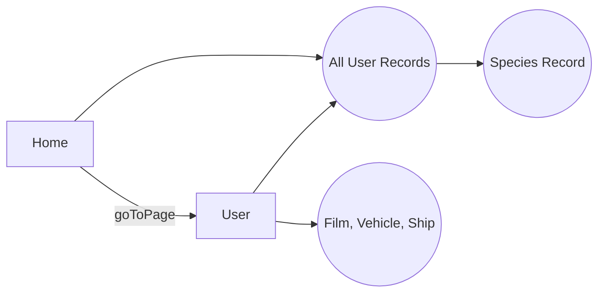

# Star Records Documentation

Star records is a REACTJS application that allows users to see user records sorted by species and gain more information by selecting or searching for a user.

# Pages

## Home

Landing page that shows all user records displayed as card with the name, as well as their species underneath. Sorted by species.

## User
Displays a list of the specific user's detailed characteristics.

# Functions

Functions are written using good variable names and in line comments to allow understanding. Main functions being:

##  Home.getStarUsers()

Gets all current user records and calls again for species name. Then sorts by species, and displays as cards on page.

## Home.searchForUser()

Finds a user if the typed text is exactly equal to it then automatically goes to the user's page.

## User.arrayCalls()

Makes a call that pertains to array based characteristics(ships,films vehicles). Then adds them to current user of page's records.

## User.waitForCalls()

Allows time to insure all http calls completed then combines UI of all the user's characteristics.

# Backend
The backend uses the api found at [swapi.dev](https://swapi.dev/api/).

## Interface Flow

